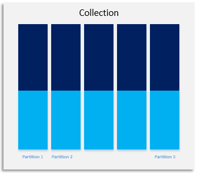
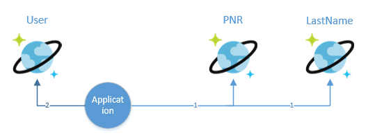
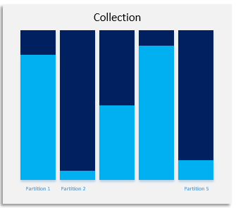
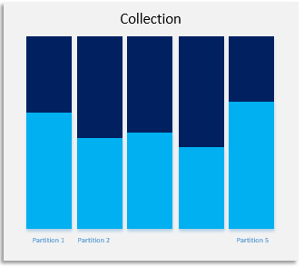
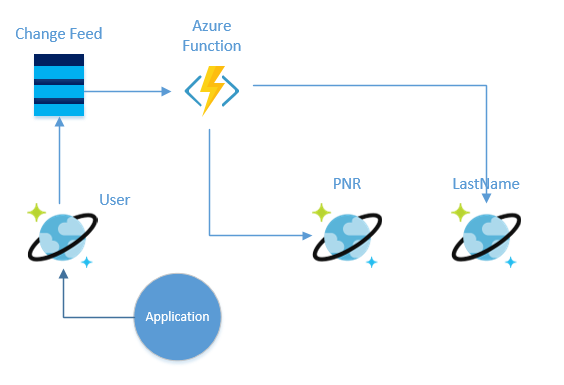

# Design Pattern – Partitioning data in multiple ways 

In this blog, you will learn how to deal with the data, which does not have a clear winner partition key. Imagine, you have data which you would like to insert with high throughput but then query the data on two or more different keys.  

The pre-requisite of this article is that you know about [Azure Cosmos DB](https://docs.microsoft.com/en-us/azure/cosmos-db/introduction)   and have  good understanding of [change feed](https://docs.microsoft.com/en-us/azure/cosmos-db/change-feed), [request unit](https://docs.microsoft.com/en-us/azure/cosmos-db/request-units) (RU) and [Azure Functions](https://azure.microsoft.com/en-us/services/functions/).

Here is the scenario, suppose you work for an airline company, and you need to store user reservation information in a collection. User Data is defined as follows:  
 
 
```
{ 
    UserId: user@email.com, 
    FirstName: John, 
    LastName: Doe, 
    PNR: 2345423, 
    CityOfOrigin: Seattle, 
    CityOfDestination: London, 
    DOB: 12.2.76, 
    other details …. 
}
```
Out of many possible values, you choose UserId (user email address) as the partition key. UserId is unique for every user so your data remain very well distributed. It is a good partition key. You see your data is distributed evenly among all the partitions as shown in Fig 1.

 Fig 1.

However, when you are querying the data, you do not always have a UserId. Some time you want to query the data by user last name or user PNR (Passenger Name Record) number.   

Azure Cosmos DB, index all your data by default. If you try to query the data by Last Name, you may get back the result, but it will cost you more RU (request units) as the query without partition key becomes a fan-out query. If this is an infrequent query, then doing a cross partition query is fine. However, if it is a frequent query, then what is the solution? 

One option to have 2 more lookup collections (PNR, LastName) for the mapping to PNR to UserId and LastName to UserId. PNR collection will have PNR as the partition key and row key and UserId as the value.   

 Fig 2.

First query  the PNR collection to get the UserId and then using the UserId value query the User Collection to get all the details.  These two calls, can complete with in few millisecond, and less RU/s are charged for these two queries when compared to a single fan out query. 

Some time, you may not like to pay extra 10 ms for two calls. In that case it is perfectly ok to duplicate the data in PNR and LastName collections. Duplicating the data is ok, for fast lookup but this may create more complexity when you are trying to update the data. Update cost will be high too. This is not a recommended pattern, but this is a desperate measure when you want to have an extreme fast lookup on different keys. 

Now, if you look at the LastName collection, you will find that the data is not equally distributed. The data will look very much like as shown in Fig 2. There are more people with last name “Smith” then “Zorkee”. 

 Fig 3.

Now, as we know this data distribution does not look good. We also know a partition key can have only 10 GB of data.   

Now, we have to think, when we are querying the data with last name, what other information we can have, can we know the origin city?  Most probably yes. In that case, we can make a partition key, which is sum of UserId + Origin City. This may help with good data distribution.    

 Fig 4.

You can use few of these tricks to distribute your data evenly in partitions. 
So, how do you populate the other collection?  

The best option to populate the other collection is to listen on the change feed of User collection, and then update the two different collections. Please see more detail here on Azure Function, Cosmos DB and change feed. 

 Fig 5.

Whenever, a record is inserted in User collection that record will show up in change feed. Azure Function get the whole document and it can update the PNR and LastName Collection accordingly. 
